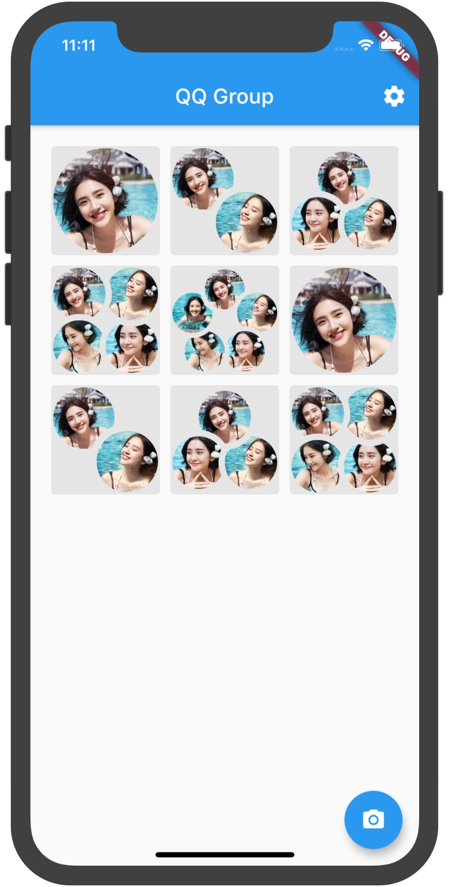
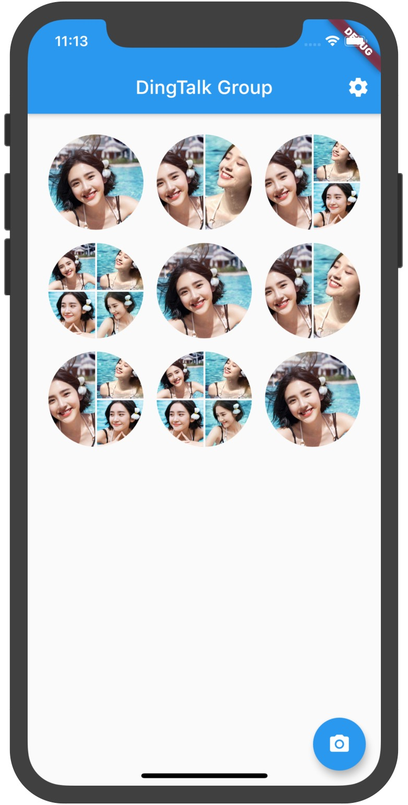
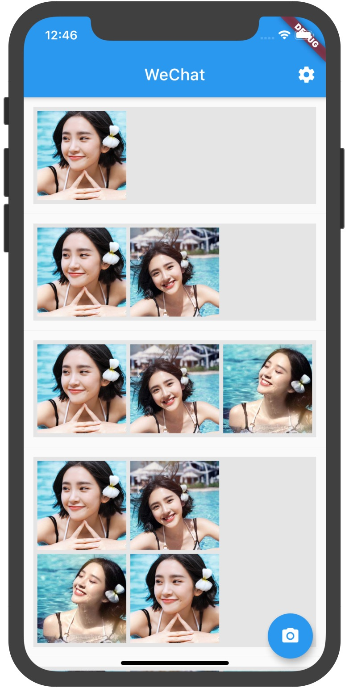
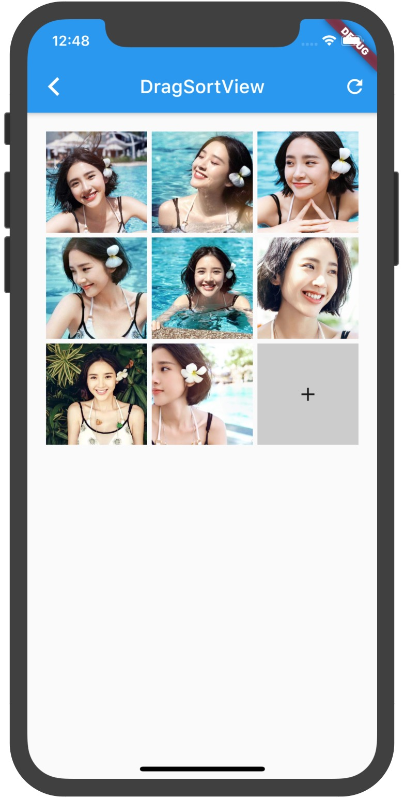
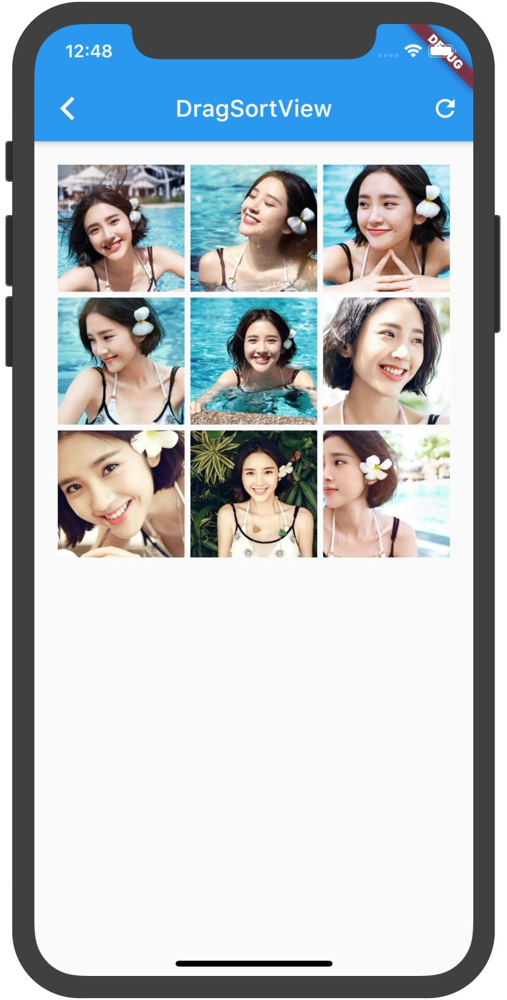

Language: English | [中文简体](README-ZH.md)

[](https://pub.dartlang.org/packages/nine_grid_view)&nbsp;&nbsp;&nbsp;&nbsp;&nbsp;&nbsp;[](https://pub.flutter-io.cn/packages/nine_grid_view)

### NineGridView
Similar to Weibo dynamics, WeChat circle of friends, nine grid view controls to display pictures. Support single big picture preview.  
It also supports WeChat group , DingTalk group, QQ group avatar effects.

### DragSortView
Similar to Weibo/WeChat release dynamic picture selection nine grid view. Support press to enlarge effect, drag and drop sorting, drag and drop to a specified location to delete.

### Pub
```yaml
dependencies:
  nine_grid_view: ^1.0.3
```

### Example

```yaml
import 'package:nine_grid_view/nine_grid_view.dart';

// bigImage param, It is recommended to use a medium-quality picture, because the original picture is too large and takes time to load.
NineGridView(
  margin: EdgeInsets.all(12),
  padding: EdgeInsets.all(5),
  space: 5,
  type: NineGridType.weChatGp,
  itemCount: itemCount,
  itemBuilder: (BuildContext context, int index) {},
);

// It is recommended to use a thumbnail picture，because the original picture is too large, it may cause repeated loading and cause flashing.
DragSortView(
  imageList,
  space: 5,
  margin: EdgeInsets.all(20),
  padding: EdgeInsets.all(0),
  itemBuilder: (BuildContext context, int index) {},
  initBuilder: (BuildContext context) {},
  onDragListener: (MotionEvent event, double itemWidth) {
    /// Judge to drag to the specified position to delete
    /// return true;
    if (event.globalY > 600) {
      return true;
    }
    return false;
  },
);   
```

### Screenshots

||||
|:---:|:---:|:---:|
||||
||||

### App
A Weibo client app developed with Flutter [Fitness](https://github.com/Sky24n/Fitness)。  
Apk ：[v0.0.3](https://github.com/Sky24n/Doc/blob/master/apks/fitness.apk) (arm64-v8a)

### Others

Another [NineGridView](https://github.com/flutterchina/flukit) in [flukit](https://github.com/flutterchina/flukit) UI Kit，using GridView implementation。But in this project used Stack + Positioned。